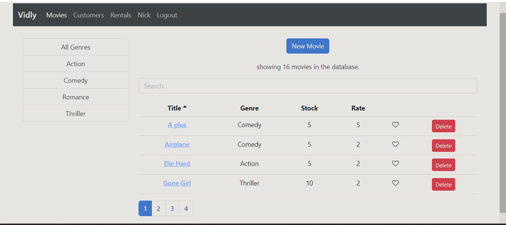
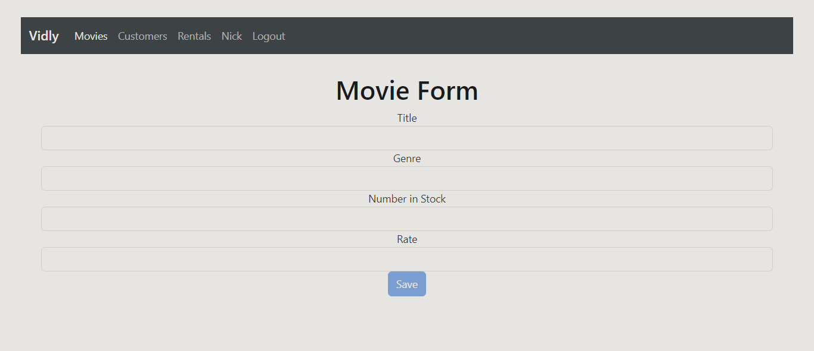

# Vidly Project

## Overview

Vidly is a movie rental application with a frontend built using React.js and a backend API built using Node.js with MongoDB. This repository contains both the frontend and backend code.

## Folder Structure

- **vidly/**: Contains the React frontend code.
- **vidly-api-nodejs-master/**: Contains the Node.js backend code.

## Setup Instructions

### Prerequisities

- Node.js
- MongoDB (Local or MongoDB Atlas)

### Installation

#### Backend Setup

- **Install backend dependencies**: `npm install`
- **Populate MongoDB with genres & movies using seeder**: `node index.js` OR `node seed.js`
- **Start backend server**: `npm start`

## Screenshots

### Movies List

### Movie Form

